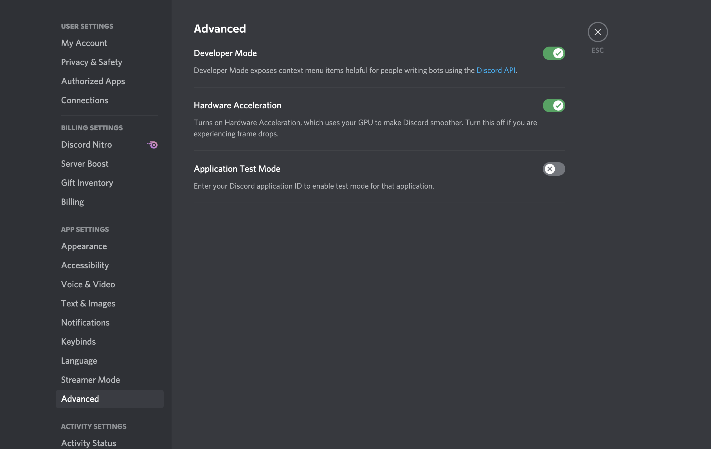
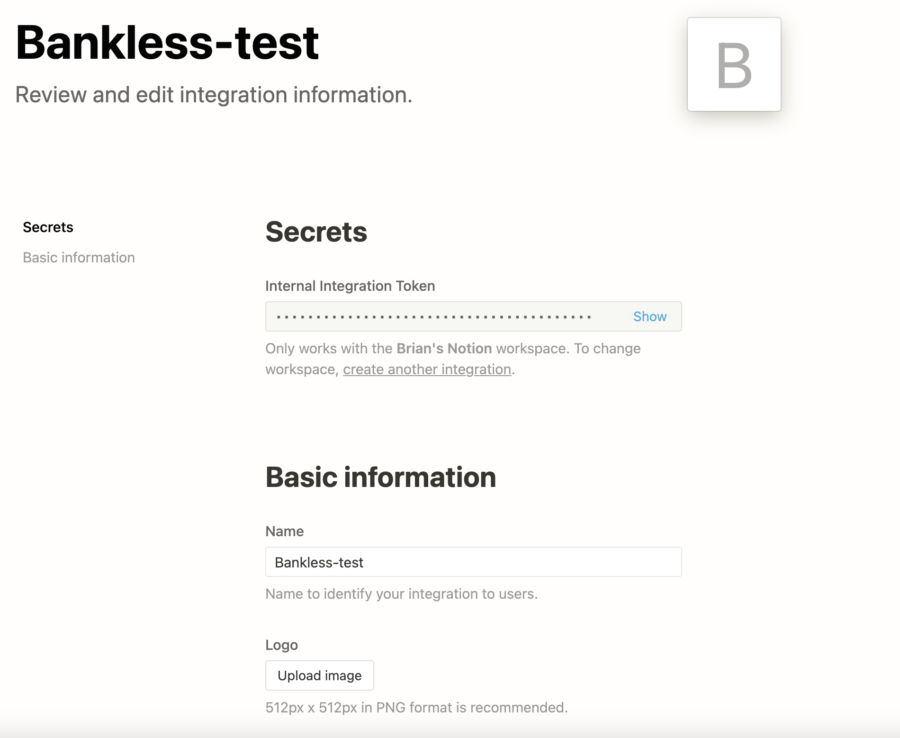

# Install

This discord bot develop is platform agnostic. It can be installed locally on windows, or unix systems where the discord
application is available.

These tools can make development quick and are recommended:

-   [git CLI](https://git-scm.com) - version control system
-   [nodejs v14.17.0](https://nodejs.org/en/) - js runtime built on chrome's v8 engine
-   [nvm](https://github.com/nvm-sh/nvm) - easily change node versions
-   [yarn v1.x](https://yarnpkg.com/) - dependency management system
-   [Docker](https://docs.docker.com/desktop/) - for local development
-   [iterm2](https://iterm2.com/) - enhanced terminal for macOS
-   [discord](https://discord.com/) - popular chat application used for gaming and organized communities

## Configuration Setup

Before the bot is ready to run there are a few configuration items that should be done. First few steps can be done following
the [discord.js guide](https://discordjs.guide/#before-you-begin);

### 1. Create environment file

Please create a `.env` with the keys below

```
DISCORD_BOT_TOKEN=<taken from discord bot applciation page>
DISCORD_BOT_PUBLIC_KEY=<taken from discord application PUBLIC KEY>
DISCORD_BOT_APPLICATION_ID=<taken from discord application APPLICATION ID>
DISCORD_OWNER_ID=<taken from discord app in TEST mode>
MONGODB_USERNAME=<mongodb user name>
MONGODB_PASS=<mongodb user password>
MONGODB_CLUSTER=<mongodb cluster url>
NOTION_TOKEN=<generated from notion integrations page>
FAQS_PAGE_ID=<personal FAQS page>
DISCORD_ROLE_GUEST_PASS=848369657281773599
DISCORD_ROLE_LEVEL_2=839005084016312360
NOTION_GUEST_PASS_DATABASE_ID=15fae33760724cf7b696a981d53e50cb
DISCORD_SERVER_ID=834499078434979890
```

### 2. Generate bot token

[https://discordjs.guide/preparations/setting-up-a-bot-application.html](https://discordjs.guide/preparations/setting-up-a-bot-application.html)
Create your own discord application and then create your own bot API key.

Retrieve the App's client ID


Retrieve the bot token


### 3. Invite bot to your personal discord

[https://discordjs.guide/preparations/adding-your-bot-to-servers.html#bot-invite-links](https://discordjs.guide/preparations/adding-your-bot-to-servers.html#bot-invite-links)
The newly created bot should be invited to your own discord space/server.

```
https://discord.com/oauth2/authorize?client_id=REPLACE_THIS_HERE&scope=bot+applications.commands
```

### 4. Enable Developer Mode

There should be a small cog near your icon photo labeled "User Settings". Hitting that there should be an option to enable
developer mode


 ### 5. Create Mongo DB

A free cloud hosted mongodb solution can be created at [https://www.mongodb.com/cloud](https://www.mongodb.com/cloud).
Alternatively a locally hosted mongodb can also be used.

Once created, the url should be passed which has the username:password combination.


If using Docker, a local instance of mongo is included when using `docker-compose`

### 6. Create Notion Integration

[https://developers.notion.com/docs/getting-started](https://developers.notion.com/docs/getting-started)



### 7. Run application

If not using docker:
```bash
yarn start
```

If using docker:
```bash
docker-compose up
```